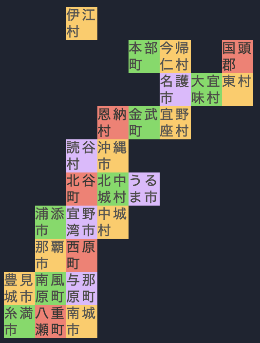

# Code Golf Championship at RubyKaigi 2024

## How to Answer

Please answer with the three hashtags #freee #RubyKaigi2024 #codegolf on X. You can either paste your code directly on X or provide the URL of your forked repository. We look forward to your answers!

## Problem

We would like you to create a map of Okinawa on the console. Please answer the comment part of the following code.

Here, `a` should be a two-dimensional array of `cell`. Also, `cell` itself is an array, the first element is the name of the city or town, and the second element should be the ANSI escape code (e.g., `"\e[43m"`).

```ruby
m = []
26.times do
  line = gets.split
  m << [line[0], "\e[#{line[1]}m", line[2].to_i, line[3].to_i]
end

# Ansher here

a.each { |row| puts row.map { |cell| "#{cell[1]}#{cell[0]}\e[0m" }.join }
```

### Input

The input will be given in the following format from the standard input. Please make sure to master the pronunciation of the city and town names!

```
Name of the city or town, color on the map (ANSI color code), X coordinate (column), Y coordinate (row)
```

**input.txt**

```
伊江村 43 2 0
本部町 42 4 1
今帰仁村 43 5 1
国頭郡 41 7 1
名護市 45 5 2
大宜味村 42 6 2
東村 43 7 2
恩納村 41 3 3
金武町 42 4 3
宜野座村 43 5 3
読谷村 45 2 4
沖縄市 43 3 4
北谷町 41 2 5
北中城村 42 3 5
うるま市 45 4 5
浦添市 42 1 6
宜野湾市 45 2 6
中城村 43 3 6
那覇市 43 1 7
西原町 41 2 7
豊見城市 43 0 8
南風原町 42 1 8
与那原町 45 2 8
糸満市 42 0 9
八重瀬町 41 1 9
南城市 43 2 9
```

### Output

```sh
ruby main.rb < input.txt
```



For example, let's focus on `本部町`(Motobu). The line corresponding to Motobu in the input is "本部町 42 4 1", where the ANSI color code is 42. Counting from the left as 0,1,2,3,4, it is displayed in the 5th column, and counting as 0,1, it is displayed in the 2nd row.
