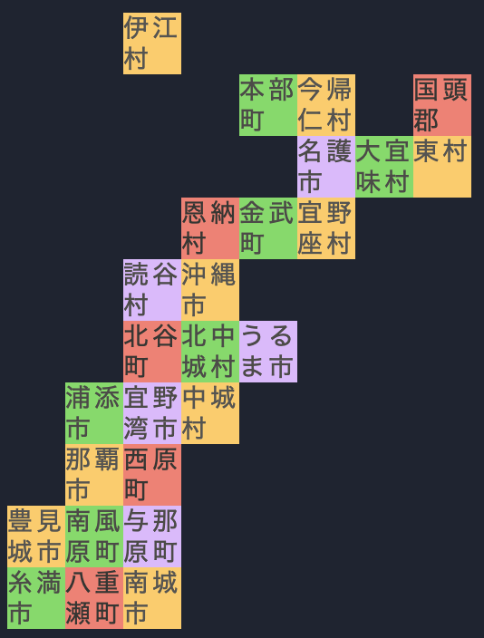

# コードゴルフ王決定戦 in RubyKaigi 2024

## 回答方法

3 つのハッシュタグ #freee #RubyKaigi2024 #codegolf を添えて、X で回答してください。 X 上で直接コードを貼り付けて回答頂くか、 fork したリポジトリの URL でも構いません。 皆様の回答をお待ちしております!

## 問題

コンソール上で沖縄の地図を作ってもらいます。 以下のコードのコメント部分を回答してください。

ここで `a` は `cell` の二次元配列にしてください。 また、 `cell` 自体も配列であり、1 つ目の要素は市町村の名前、2 つ目 の要素は ANSI エスケープコード (例:`"\e[43m"`)にしてださい。

```ruby
m = []
26.times do
  line = gets.split
  m << [line[0], "\e[#{line[1]}m", line[2].to_i, line[3].to_i]
end

# ここを回答

a.each { |row| puts row.map { |cell| "#{cell[1]}#{cell[0]}\e[0m" }.join }
```

### 入力

入力は以下の形式で標準入力から与えられます。ぜひ、市町村の読み方もマスターしてください！

```
市町村名、地図上での色（ANSIカラーコード）、X座標（列）, Y座標（行）
```

**input.txt**

```
伊江村 43 2 0
本部町 42 4 1
今帰仁村 43 5 1
国頭郡 41 7 1
名護市 45 5 2
大宜味村 42 6 2
東村 43 7 2
恩納村 41 3 3
金武町 42 4 3
宜野座村 43 5 3
読谷村 45 2 4
沖縄市 43 3 4
北谷町 41 2 5
北中城村 42 3 5
うるま市 45 4 5
浦添市 42 1 6
宜野湾市 45 2 6
中城村 43 3 6
那覇市 43 1 7
西原町 41 2 7
豊見城市 43 0 8
南風原町 42 1 8
与那原町 45 2 8
糸満市 42 0 9
八重瀬町 41 1 9
南城市 43 2 9
```

### 制限

- 地図のサイズは１０行８列
- 市町村じゃない部分（海）は無色
- 市町村の名前は全て４文字以内
- 入力の行数は２６
- 0 <= X <= 7 (コンソールの右方向を正とする)
- 0 <= Y <= 9 (コンソールの下方向を正とする)

### 出力

```sh
ruby main.rb < input.txt
```



例えば、本部町に着目してみます。入力のうち本部町に該当する行は 本部町 42 4 1 となっており、ANSI カラーコードは 42 で左から 0,1,2,3,4 と数えるので 5 列目、0,1 と数えるので 2 行目に表示されています。
